# Traffic Accident Analysis


---
## Course:
DSA1080UA, Programming For Data Science

## Lecturer:
Mr. Austin Odera

## Prepared by:
1. Sharon Mukami Mungai — 677714
2. Brian Muuo Kitili — 677038

## Project Links:
1. Github: **[Open Github](https://github.com/Sharon-Mukami/Traffic_Accident_Analysis)**
2. Streamlit Demo: **[Open Streamlit](https://5ochd9jh4jebkjgt9bejmh.streamlit.app/)**
3. Presentation slides: [Slides](https://github.com/Sharon-Mukami/Traffic_Accident_Analysis/blob/main/presentation/Traffic-Accident-Analysis.pptx)

## Submission Date:
6/08/2026
---
## Project Description

This project analyzes road traffic accident data using Python to identify patterns, trends, and possible factors contributing to road accidents.
Through data cleaning, exploratory data analysis, and visualization, the project aims to provide insights that can support road safety planning and decision making.

## Problem Statement

Road traffic accidents remain one of the leading causes of injuries and fatalities worldwide. Although large amounts of accident data are collected by government agencies and transportation departments, the data is often underutilized.
**This project seeks to analyze traffic accident records to answer important questions such as:**

- When do most accidents occur?
- Which locations experience the highest accident rates?
- What are the major causes of accidents?
- Which weather conditions contribute to accidents?
- Which road users are most affected?

## Target Users

The analysis may benefit:

- Road Safety Authorities
- Traffic Police Departments
- County Governments
- Transport Planners
- Researchers
- Insurance Companies
- Members of the Public

---

## Dataset

**Source:**

[Kaggle Traffic Accident Dataset](https://www.kaggle.com/code/hahmacp/road-accident-severity-classification/input)

- **Number of rows:** 12,316 records
- **Number of columns:** 25 variables

- **Key variables:**
- **Temporal information:** Time, Day_of_week
- **Driver characteristics:** Age_band_of_driver, Sex_of_driver, Driving_experience
- **Vehicle information:** Type_of_vehicle, Owner_of_vehicle, Service_year_of_vehicle
- **Road and environmental conditions:** Area_accident_occured, Road_surface_type, Road_surface_conditions, Weather_conditions, Light_conditions
- **Accident details:** Type_of_collision, Vehicle_movement, Cause_of_accident, Accident_severity
- **Casualty information:** Sex_of_casualty, Age_band_of_casualty, Casualty_severity, Fitness_of_casuality, Pedestrian_movement
- **Count variables:** Number_of_vehicles_involved, Number_of_casualties
  
## Project Structure

```
Traffic_Accident_Analysis/
│
├── app.py                     # Streamlit web application
├── requirements.txt           # Project dependencies
├── runtime.txt                # Python version for deployment
├── README.md                  # Project documentation
│
├── data/
│   ├── Raw_data.csv
│   └── Cleaned_data.csv
│
├── notebooks/
│   └── analysis.ipynb         # Data cleaning, EDA and analysis
│
├── visuals/
│   ├── Standardize_and_correct_errors.PNG
│   ├── Feature_selction.PNG
│   ├── convert_to_right_data_types.PNG
│   ├── Handling_missing_values.PNG
│   ├── Locations_by_Accidents_count.png
│   ├── Accidents_by_hour_of_day.png
│   ├── Accidents_by_Day_of_week.png
│   ├── Causes_of_accidents_by_count.png
│   ├── Accident_severity_by_Weather_conditions.png
│   ├── Distribution_of_Accident_Severity.png
│   ├── Vehicle_Types_by_accident_count.png
│   ├── AccidentSeverity_by_Casualty_ageband.png
│   └── Association_between_categorical_variables.png
│
└──
```

## Tools Used

- Python
- Pandas
- NumPy
- Matplotlib
- Seaborn
- Jupyter Notebook
- Git
- GitHub
- Streamlit


## Data Cleaning

The dataset was cleaned before analysis to improve consistency and reliability.
<table>
<tr>
<td align="center">

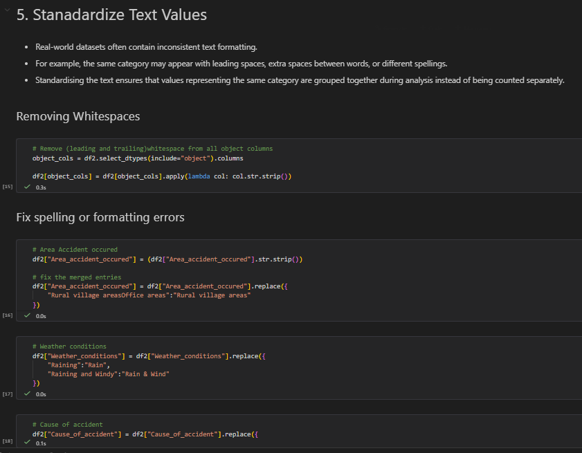<br>
<b>Standardize and Correct Errors</b>

</td>

<td align="center">

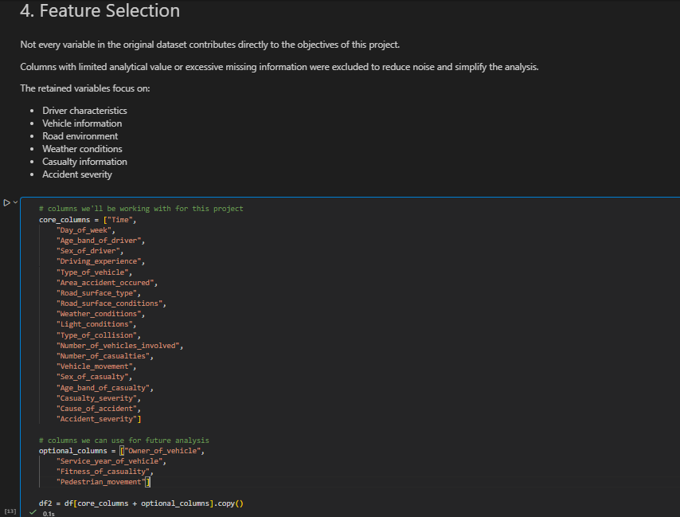<br>
<b>Feature Selection</b>

</td>
</tr>

<tr>
<td align="center">

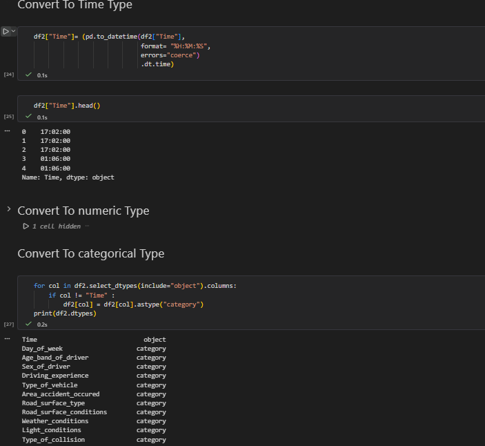<br>
<b>Convert to Appropriate Data Types</b>

</td>

<td align="center">

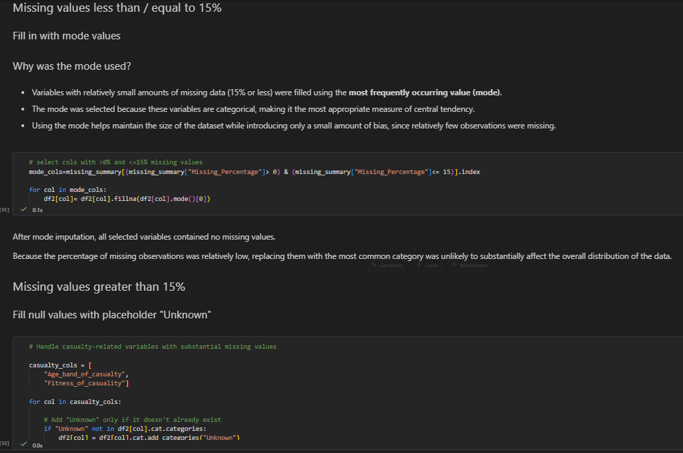<br>
<b>Handling Missing Values</b>

</td>
</tr>
</table>

The main preprocessing steps included:

- Selecting only the variables relevant to the analysis.
- Standardizing text values by removing extra spaces and formatting inconsistencies.
- Converting variables into appropriate data types.
- Handling missing values using different approaches depending on the proportion of missing data.
- Correcting inconsistent category labels.
- Creating descriptive labels for accident severity.
- Saving the cleaned dataset for further analysis.

---

## Exploratory Data Analysis

The following questions were explored during the analysis:

1. Which locations experience the highest number of accidents?
   
  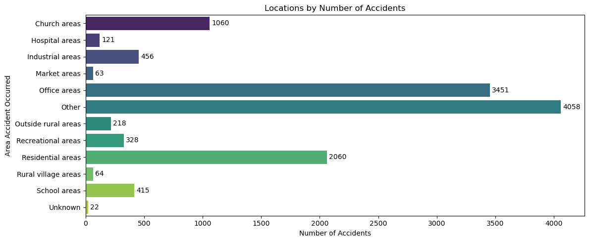
   
2. What time of day do most accidents occur?

   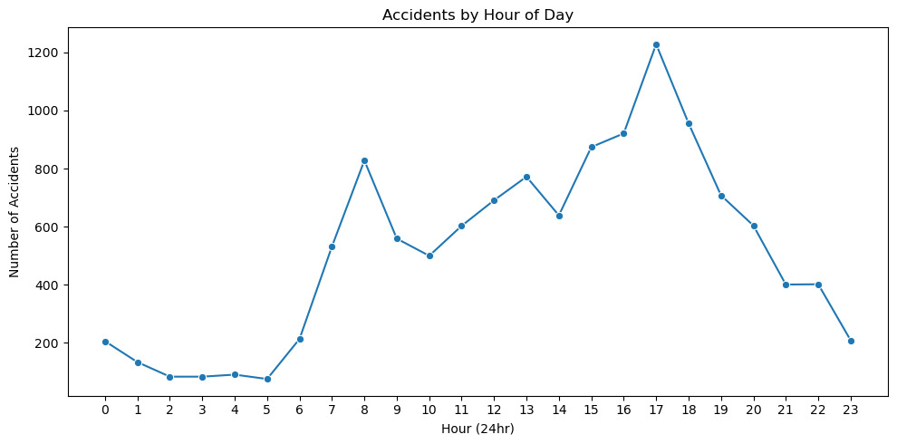
   
3. Which days of the week record the highest number of accidents?

  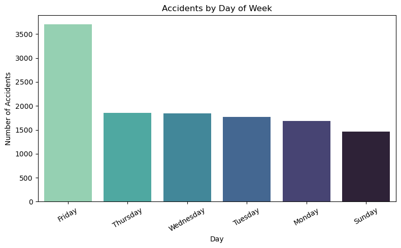

4. What are the leading causes of accidents?
 
  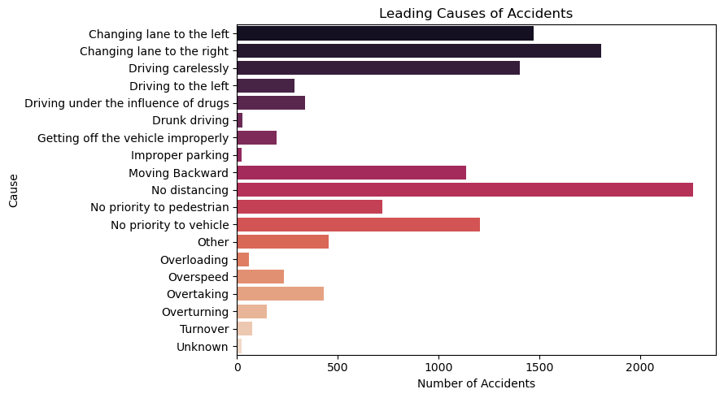

5. How do weather conditions relate to accident occurrence?
   
  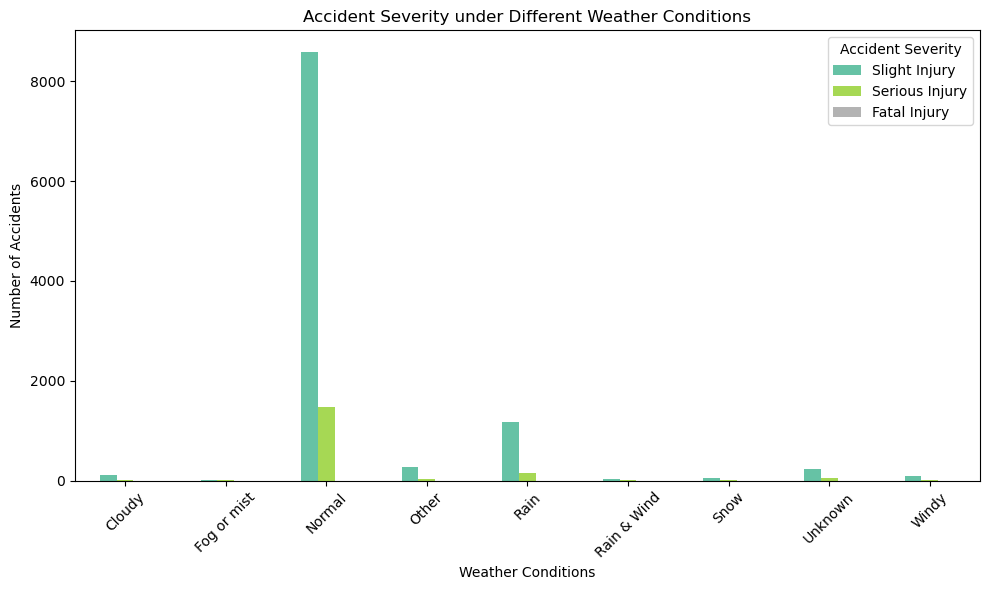

6. What is the distribution of accident severity?

   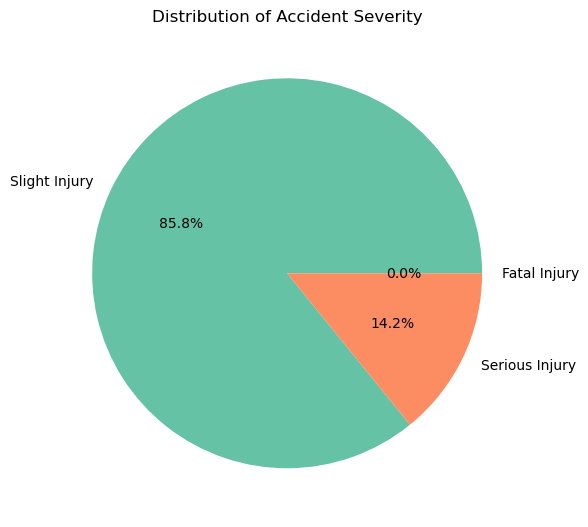
   
7. Which vehicle types are most frequently involved in accidents?

   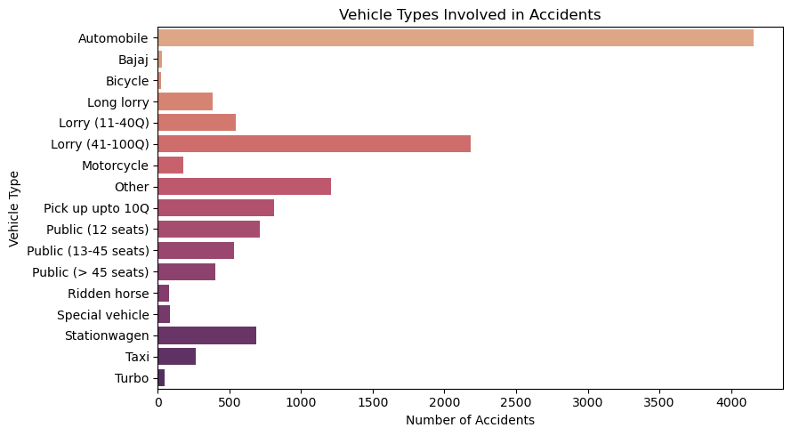
   
8. Which road users are most affected?

   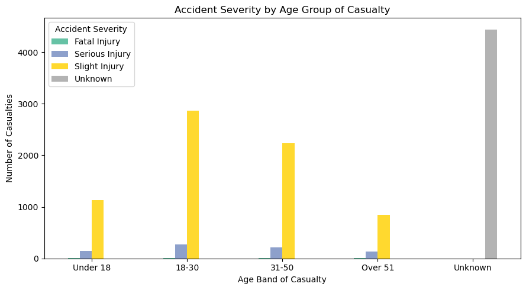
    
10. How are the key categorical variables associated with one another?
 
   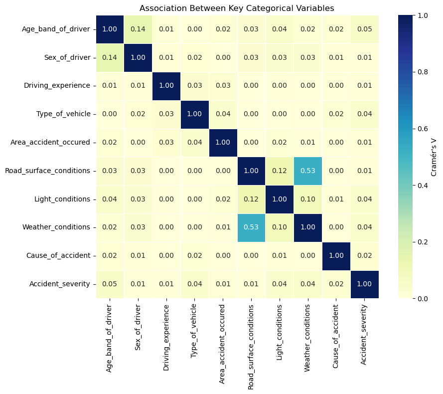

---

## Key Findings

The analysis revealed several important patterns:

- Office areas and residential areas recorded the highest number of reported accidents.
- Accident frequency increased during the morning hours and peaked in the late afternoon, around **5 PM**.
- Friday recorded the highest number of accidents, while Sunday had the fewest.
- The most common causes of accidents included:
- Failure to maintain sufficient distance between vehicles
- Improper lane changing
- Careless driving
- Failure to give priority to other vehicles
- Most accidents occurred under normal weather conditions, indicating that driver behavior may have a greater influence than weather alone.
- Slight injuries accounted for the majority of accident outcomes.
- Automobiles were involved in the highest number of reported accidents, followed by large lorries.
- Young adults aged **18–30 years** were the most affected casualty group, while males accounted for more reported casualties than females.
- The categorical association analysis showed generally weak relationships between most variables, with the strongest association observed between **weather conditions** and **road surface conditions**.

---

## Recommendations

Based on the analysis, the following recommendations are suggested:

- Promote safer driving practices through road safety awareness campaigns.
- Strengthen enforcement of traffic rules, particularly during peak accident hours.
- Focus road safety interventions in accident-prone locations such as office and residential areas.
- Develop targeted education programmes for young drivers and other high-risk road users.
- Improve the quality and completeness of accident records by including additional information such as accident dates and locations.
- Extend the project by developing predictive models to estimate accident severity and identify high-risk scenarios.

---

## How to Run the Project

1. Clone this repository

```bash
git clone https://github.com/Sharon-Mukami/Traffic_Accident_Analysis
```

2. Move into the project folder

```bash
cd traffic-accident-analysis
```

3. Install required packages

```bash
pip install -r requirements.txt
```

4. Open the notebook

```bash
Jupyter notebook
```

5. Run all cells.

---

## Disclaimer

**This project is for academic purposes.**
